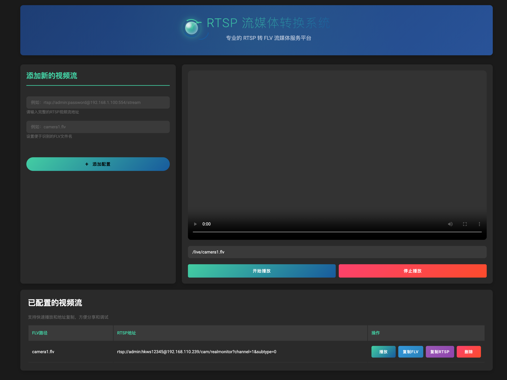

# 🎥 stre-flv flv流媒体转换系统

## 📖 项目介绍
Stre-Flv是一个依托于 ffmpeg实现RTSP转FLV流媒体转换系统，支持实时视频流转换和在线播放。

## ✨ 特性

- 🔄 实时RTSP转FLV流转换
- 🎮 在线视频流播放器
- 💾 配置持久化存储
- 🔌 动态流配置管理
- 🎯 低延迟视频传输
- 🛡 稳定可靠的性能
- 🎨 美观的Web界面

## 🚀 快速开始

### 环境要求

- Java 8+
- Redis
- FFmpeg
- Maven 3.6+

### 安装FFmpeg

#### Windows

1. 下载FFmpeg：[FFmpeg下载页面](https://ffmpeg.org/download.html)
2. 解压到指定目录，例如：`C:\ffmpeg`
3. 配置环境变量：
   - 右键点击“此电脑” -> “属性” -> “高级系统设置” -> “环境变量”
   - 在“系统变量”中找到“Path”，点击“编辑”
   - 点击“新建”，添加FFmpeg的安装路径，例如：`C:\ffmpeg\bin`
4. 验证FFmpeg是否安装成功：
   - 打开命令提示符（cmd），输入`ffmpeg`，如果显示FFmpeg的版本信息，则表示安装成功

#### Linux

1. 安装FFmpeg：
   - 使用包管理器安装，例如：`sudo apt-get install ffmpeg`
2. 验证FFmpeg是否安装成功：
   - 打开终端，输入`ffmpeg`，如果显示FFmpeg的版本信息，则表示安装成功

### 安装Redis

1. 下载Redis：[Redis下载页面](https://redis.io/download)
2. 解压到指定目录，例如：`/usr/local/redis`
3. 配置环境变量：
   - 在`/etc/profile`文件中添加以下内容：`export PATH=/usr/local/redis/bin:$PATH`
4. 启动Redis：`redis-server`
5. 验证Redis是否安装成功：`redis-cli ping`，如果返回`PONG`，则表示安装成功

### 启动项目

1. 下载项目代码
2. 使用IDEA打开项目
3. 配置Redis连接信息
4. 运行项目
5. 访问`http://localhost:8080`，如果显示项目主页，则表示启动成功

